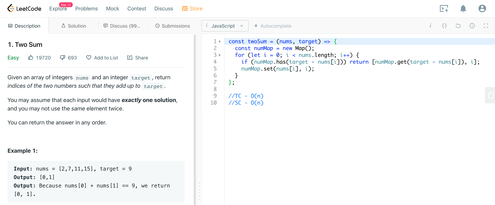

# Hi, I'm Jacki

I love coding, spreading positivity and hearing feedback! Feel free to connect, send feedback or submit a PR with really cool ideas :)

## Leet-Code
Solving leetcode problems one line at a time. This repo offers insights on javascript naive to optimized solutions (some in progress).

Here is an example of the toy problems that are highlighted in this repo:

-The coveted "Blind75" was the main focus. (https://leetcode.com/discuss/general-discussion/460599/blind-75-leetcode-questions)

-Check it out my solutions in javascript and clone the Blind75 list to your account to start tackling them today!