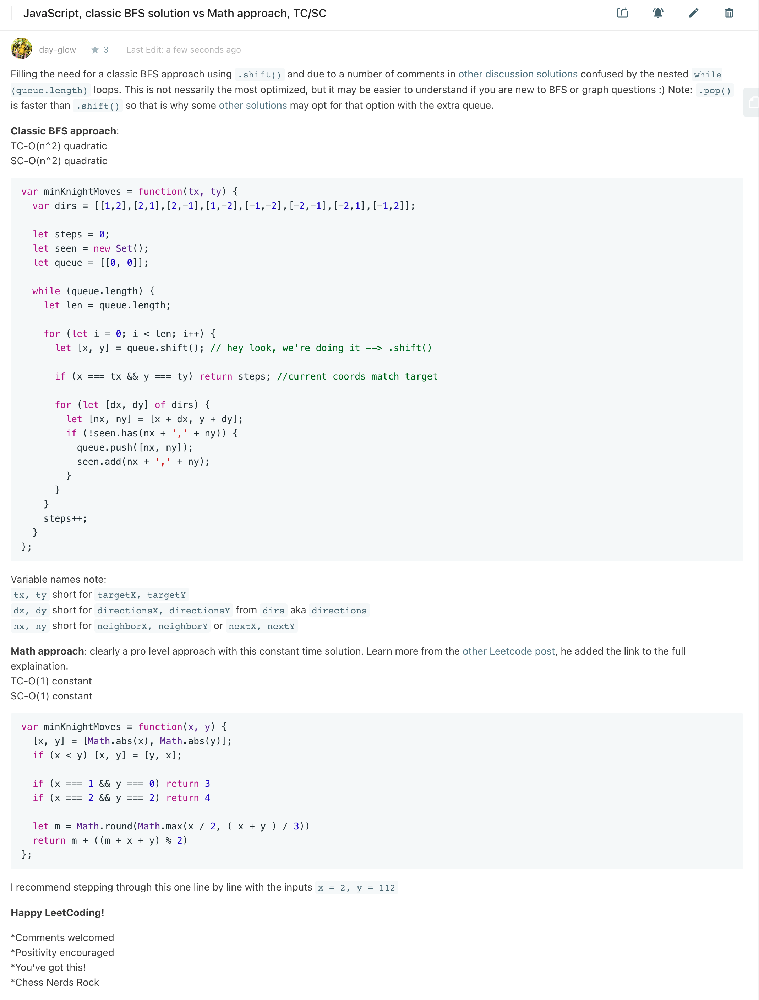

# Leet-Code
Solving leetcode problems one line at a time. This repo offers insights on javascript naive to optimized solutions (some in progress).

Here is an example of the toy problems that are highlighted in this repo:

### Blind75
1) The coveted ["Blind75"](https://leetcode.com/discuss/general-discussion/460599/blind-75-leetcode-questions "Blind75 List") was the main focus.
2) Clone the Blind75 list to your account to start tackling them today. The first comment in the link above will allow you to clone the list to your account.
3) Clone down this repo to check it out my solutions in javascript and help optimize your approach.

### Getting involved in the Leetcode discussion board
If you find my solutions helpful, please upvote some of my discussion board solutions on Leetcode.

[142. Linked List Cycle II Solution](https://leetcode.com/problems/linked-list-cycle-ii/discuss/994424/javascript-Two-Pointers-faster-than-99.89%3A-if-you-know-141.LinkedListCycle-you'll-like-this)

[1197. Minimum Knight Moves Solution](https://leetcode.com/problems/minimum-knight-moves/discuss/1116030/JavaScript-classic-BFS-solution-vs-Math-approach-TCSC)

[277. Find the Celebrity Solution](https://leetcode.com/problems/find-the-celebrity/discuss/1005437/Javascript-Better-variable-names-easier-to-follow)

[252. Meeting Rooms Solution](https://leetcode.com/problems/meeting-rooms/discuss/1058624/sort-and-forEach-loop)

[1004. Max Consecutive Ones III Solution](https://leetcode.com/problems/max-consecutive-ones-iii/discuss/1029876/Concise-Never-Shrinking-Sliding-Window-Approach)

# Solved by Jacki
I love coding, spreading positivity and hearing feedback! Let's connect.

<!-- LinkedIn -->

<!-- Github -->

<!-- Email -->
